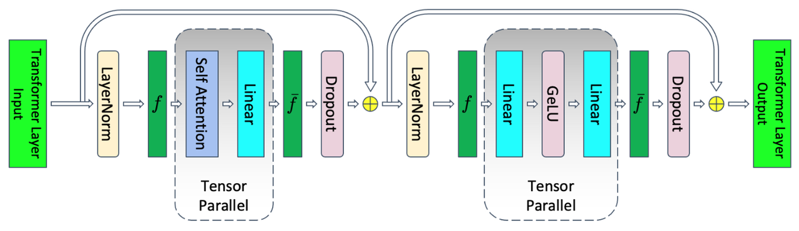
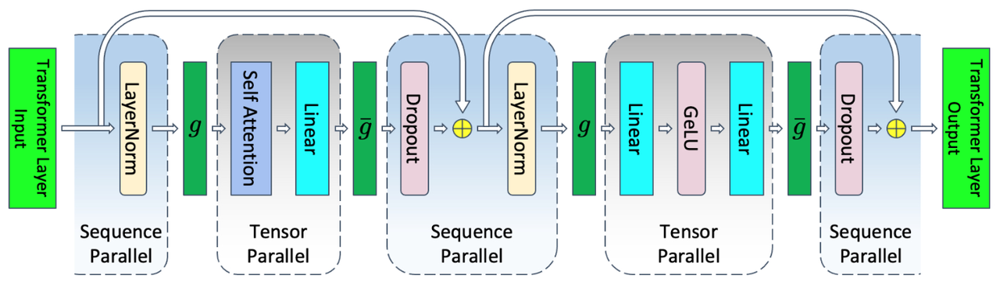
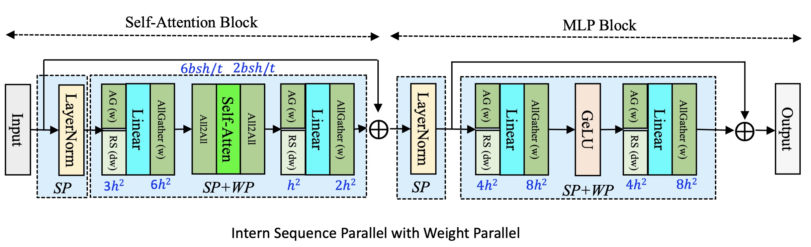

并行训练
==================

.. Brief introduction to training parallelism, and how-to guide about config setting

InternEvo 支持张量并行、流水线并行、序列并行、数据并行和 ZeRO1.5 等并行化训练策略。在初始化分布式环境时，我们需要指定张量并行大小、流水线并行大小、数据并行大小以及 ZeRO1.5 策略。

InternEvo 的并行设置由配置文件中的 ``parallel`` 字段指定，用户可以通过修改配置文件 `config file <https://github.com/InternLM/InternEvo/blob/develop/configs/7B_sft.py>`_ 来更改并行配置。以下是一个并行训练配置示例：

.. code-block:: python

    parallel = dict(
        zero1=dict(size=8),
        tensor=dict(size=1, mode="mtp"),
        pipeline=dict(size=1, interleaved_overlap=True),
        weight=dict(size=1, overlap=True, memory_pool=True),
    )

- zero1：zero 并行策略，分如下三种情况，默认值为 -1

    - 当 ``size <= 0``，则 zero1 进程组的大小等于数据并行进程组的大小，因此优化器状态参数将在数据并行范围内分配
    - 当 ``size == 1``，则不使用 zero1 ，所有数据并行组保留完整的优化器状态参数
    - 当 ``size > 1`` 且 ``zero1 <= data_parallel_size``，则 zero1 进程组是数据并行进程组的子集

- tensor：张量并行策略

    - size：张量并行大小，通常是每个节点的 GPU 数量，默认值为 1
    - mode：张量并行模式，支持['mtp', 'msp', 'fsp', 'isp']，其中，

        - mtp：表示使用 Megatron-LM 的张量并行实现方案，不包含序列并行，mtp 为默认模式
        - msp：表示使用 Megatron-LM 的序列化并行实现方案，序列并行大小 = 张量并行大小
        - fsp：表示使用 flash-attn 实现模式的张量并行与序列并行，序列并行大小 = 张量并行大小
        - isp：InternEvo 系统自研的序列化并行方案，可以与权重并行结合使用，序列并行大小与权重并行大小互相独立

- pipeline：流水线并行策略

    - size：流水线并行大小，默认值为 1
    - interleaved_overlap：bool 类型，交错式调度时，开启或关闭通信优化，默认值为 False

- weight：权重并行策略，只能与 isp 张量并行模式结合使用

    - size：权重并行大小，默认值为 1
    - overlap：是否开启计算与通信的 overlap，默认值为 False
    - memory_pool：是否开启权重显存池，默认值为 False

注意：数据并行大小 = 总的 GPU 数目 / 流水线并行大小 / 张量并行大小

张量并行
-----------------

InternEvo 系统 ``v0.3.0`` 版本在张量并行策略上有较大更新，目前的张量并行支持四种模式配置['mtp', 'msp', 'fsp', 'isp']，前三种模式为基于 Megatron-LM 的张量并行和序列化并行的策略实现，最后一种模式为 InternEvo 系统自研，可与权重并行（Weight Parallel）结合使用的一种新的序列化并行方式。接下来详细介绍这几种张量并行模式的区别。

- MTP

MTP(Megatron-LM Tensor Parallel)， 为默认的张量并行模型，引用自 `Megatron-LM Tensor Parallel <https://arxiv.org/abs/2205.05198>`_ 并行方案，如下图所示，带有张量并行的 ``Transformer`` 层：

  Transformer layer with tensor parallelism.

MTP 主要对 `attention <https://github.com/InternLM/InternEvo/blob/develop/internlm/model/multi_head_attention.py>`_ 和 `linear <https://github.com/InternLM/InternEvo/blob/develop/internlm/model/linear.py>`_ 这两个模块进行张量并行操作。假设张量并行大小为 ``tp``，输入数据的序列长度为 ``seqlen``，隐藏层大小为 ``hidden size``，则张量并行期间产生的激活值 ``shape`` 为 ``[seqlen, hidden_size/tp]``。

MTP 张量并行引入的通信如上图所示，其中 ``f`` 和 ``f̄`` 是共轭的。在前向传递中 ``f`` 是无操作，而在反向传递中进行 ``all-reduce`` 操作。而 ``f̄`` 在前向传递中进行 ``all-reduce`` 操作，在反向传递中是无操作。

- MSP

MSP(Megatron-LM Sequence Parallel)，引用自 `Megatron-LM Sequence Parallel <https://arxiv.org/abs/2205.05198>`_ 并行方案，如下图所示，带有张量并行和序列化并行的 ``Transformer`` 层：

  Transformer layer with tensor and sequence parallelism.

与 MTP 对比，我们可以发现，MSP 主要针对未进行张量并行的模块，如 ``LayerNorm`` 和 ``Dropout`` 等模型进行序列化并行操作。需要注意的是，序列化并行大小与张量并行大小相等，且共用通信组。假设张量并行大小为 ``tp``，输入数据的序列长度为 ``seqlen``，隐藏层大小为 ``hidden size``，则序列化并行期间产生的激活值形状为 ``[seqlen/tp, hidden_size]``，张量并行期间产生的激活值形状为 ``[seqlen, hidden_size/tp]``。

MSP与MTP相比，通信原语有所变化，如上图所示 ``g`` 和 ``ḡ`` 是共轭的。在前向传递中 ``g`` 进行 ``all-gather`` 操作，而在反向传递中进行 ``reduce-scatter`` 操作。而 ``ḡ`` 在前向传递中进行 ``reduce-scatter`` 操作，在反向传递中进行 ``all-gather`` 操作。

在前向传递中 ``g`` 通信处于序列化并行和张量并行的交接处，进行的是激活值在 ``seqlen`` 维度的 ``all-gather`` 操作，该通信完成后，激活值形状变成完整的 ``[seqlen, hidden_size]``，然后进入张量并行模块范围。``ḡ`` 通信处于张量并行和序列化并行的交接处，需要把 MTP 中的 ``all-reduce`` 通信操作变成 ``reduce-scatter``，才能完成 ``seqlen`` 维度的切分，激活值形状变成 ``[seqlen/tp, hidden_size]``，从而正常进入序列化并行的阶段。而反向传递时，则是同样的道理。

- FSP

FSP(Flash-Attn Sequence Parallel)，引用自 `flash attention <https://github.com/Dao-AILab/flash-attention>`_ 的序列化并行实现方案。该实现方案与 MSP 的唯一区别在于，在 ``g`` 进行 ``all-gather`` 通信后，MSP 会存储一份完整的输入数据用于 backward 计算，而 FSP 则只存储 ``seqlen`` 切分后的输入数据，因此在进行 backward 计算时，需要再额外 ``all-gather`` 一次输入。

因此，FSP 与 MSP 性能对比的话，会有更小的显存占用，但是由于引入额外的 ``all-gather`` 通信，会导致训练速度 TGS 降低。

- ISP

ISP(Intern Sequence Parallel)，InternEvo 系统自研的灵活可扩展序列化并行方案，支持张量并行与序列化并行解耦，通过计算和通信的overlap提高训练性能，并基于显存池管理降低显存碎片化的可能性，提高显存利用率。

以 `configs/7B_isp_sft.py <https://github.com/InternLM/InternEvo/blob/develop/configs/7B_isp_sft.py>`_ 配置文件为例，将 ``tensor.mode`` 字段设置为 ``isp``，而 ``tensor.size`` 字段代表的是数据 ``seqlen`` 维度切分大小。ISP 算法可与 ``weight parallel`` 结合使用，其中 ``weight.size`` 字段代表的是模型权重切分大小，将 ``weight.overlap`` 字段设置为 ``True`` 即为开启计算与通信的 ``overlap``，可提高训练性能。将 ``weight.memory_pool`` 字段设置为 ``True`` 即为开启显存池管理功能，可一定程度降低 GPU 显存碎片的可能性，提高显存利用率。

.. code-block:: python

    parallel = dict(
        zero1=dict(size=-1),
        tensor=dict(size=2, mode="isp"),
        pipeline=dict(size=1, interleaved_overlap=True),
        weight=dict(size=4, overlap=True, memory_pool=True),
    )

如下图所示，带有序列化并行和权重并行的 ``Transformer`` 层：

如图所示，ISP 的序列化并行范围覆盖整个 ``Transformer`` 模型层，模型权重并行主要针对 ``Attention`` 和 ``MLP Block`` 的 ``Linear module``。

通信原语变化情况为，在前向传递时，每个 ``Linear`` 需要进行模型权重的 ``all-gather`` 通信；在后向传递时，每个 ``Linear`` 在进行后向计算前需要进行模型权重的 ``all-gather`` 通信，在后向计算后，需要进行模型权重的梯度的 ``reduce-scatter`` 通信操作。

需要注意的是，与 MSP 和 FSP 相比，在进行 ``attention score`` 计算时，ISP 也有通信原语的一些变化，如 ``Self-Atten`` 前后各增加了一个 ``all-to-all`` 通信操作，用于完成激活值形状的转置，目的是在进行 ``attention score`` 计算时能保持原有的张量并行的模式。

关于 ISP 算法更多的设计思路和性能评测，请参考论文 `InternEvo: Efficient Long-sequence Large Language Model Training via Hybrid Parallelism and Redundant Sharding <https://arxiv.org/abs/2401.09149>`_。

流水线并行
-----------------

InternEvo 在流水线并行中使用 `1F1B <https://arxiv.org/pdf/2104.04473.pdf>`_ （1F1B，一次前向传递后跟一次反向传递）策略。对于 1F1B 策略，有两种实现方式：

1. 非交错调度器，内存高效。
2. 交错调度器，内存高效且时间高效（GPU空泡较少）。

.. figure:: ../../imgs/pipeline_schedule.png
  :scale: 30%
  :class: with-border

  1F1B 流水线并行调度器，采用自 `Megatron-LM <https://arxiv.org/pdf/2104.04473.pdf>`_

非交错式流水线调度
~~~~~~~~~~~~~~~~~~~~~~~~~~~~~~~~~~~~~~~~~~~
如果要使用非交错式调度, 需要设置 ``model.num_chunks = 1``。

.. autoclass:: internlm.core.scheduler.pipeline_scheduler.PipelineScheduler
    :members:

交错式流水线调度
~~~~~~~~~~~~~~~~~~~~~~~~~~~~~~~~~~~~~~~
如果要使用交错式调度, 需要设置 ``model.num_chunks > 1``。

.. autoclass:: internlm.core.scheduler.pipeline_scheduler.InterleavedPipelineScheduler
    :members:

值得注意的是，在使用交错式流水线调度器时可启用通信优化功能，即在 1F1B 阶段启用异步通信，以充分利用上行/下行带宽并实现通信与计算重叠。

用户需要在配置文件中设置 ``parallel.pipeline.interleaved_overlap = True``。该功能启用后，将调用函数 ``InterleavedPipelineScheduler._run_1f1b_loop_with_overlap``，并创建 ``internlm.core.communication.AsynCommunicator`` 以管理异步通信。

``1F1B-without-overlap`` 和 ``1F1B-with-overlap`` 的区别如下所示：

.. code-block:: bash

    # The 1F1B stage without overlap consists of the following steps:
    1. Perform the forward pass.
    2. Perform the backward pass.
    3. Send the forward output of this iteration to the next stage, and send the backward output of this iteration to the previous stage, and receive the forward and backward inputs for the next iteration.

.. code-block:: bash

    # The 1F1B stage with overlap consists of the following steps:
    1. Perform the forward pass.
    2. Check if the backward input is ready.
    3. Send the forward output and receive the forward input for the next iteration.
    4. Perform the backward pass.
    5. Check if the forward input is ready.
    6. Send the backward output and receive the backward input for the next iteration.

数据并行
-----------------

InternEvo 支持数据并行。数据并行大小为:

`Data parallel size = Total number of GPUs / Pipeline parallel size / Tensor parallel size`

ZeRO1.5
-----------------

ZeRO1.5 的实现使用了分层分片的概念，通过配置值 ``parallel.zero1`` 启用了本地节点内的分片。这个方法有助于有效管理和分配模型参数和梯度，以减少内存使用并提高训练效率。

1. 当 ``parallel.zero1 <= 0``，则 zero1 进程组的大小等于数据并行进程组的大小，因此优化器状态参数将在数据并行范围内分配
2. 当 ``parallel.zero1 == 1``，则不使用 zero1 ，所有数据并行组保留完整的优化器状态参数
3. 当 ``parallel.zero1 > 1`` 且 ``parallel.zero1 <= data_parallel_world_size``，则 zero1 进程组是数据并行进程组的子集

此外，用户可以在配置文件中通过 ``hybrid_zero_optimizer`` 字段启用优化器的通信优化功能，设置桶大小，以及梯度剪裁等参数。这些设置有助于优化训练过程中的通信和计算效率，以及梯度的处理方式。

.. code-block:: python

    hybrid_zero_optimizer = dict(
        # Enable low_level_optimzer overlap_communication
        overlap_sync_grad=True,
        overlap_sync_param=True,
        # bucket size for nccl communication params
        reduce_bucket_size=512 * 1024 * 1024,
        # grad clipping
        clip_grad_norm=1.0,
    )

这里有两个值得关注的通信优化点：

- overlap_sync_grad: 如果设置为 ``True``，则将训练的 ``backward pass`` 与梯度的 ``all-reduce`` 通信重叠
- overlap_sync_param: 如果设置为 ``True``，则将参数的 ``broadcast`` 通信与下一步的 ``forward pass`` 进行重叠

这些优化可以加速训练过程，提高训练效率。

.. autoclass:: internlm.solver.optimizer.hybrid_zero_optim.HybridZeroOptimizer
    :members:
